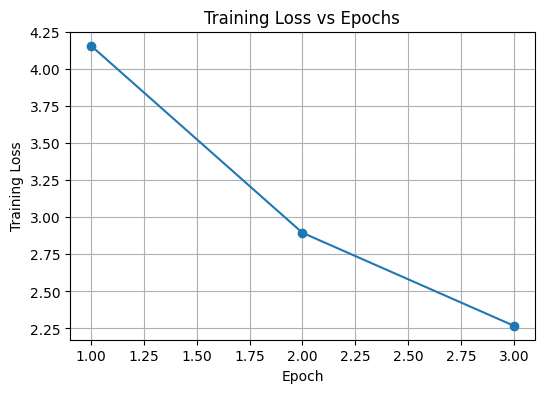
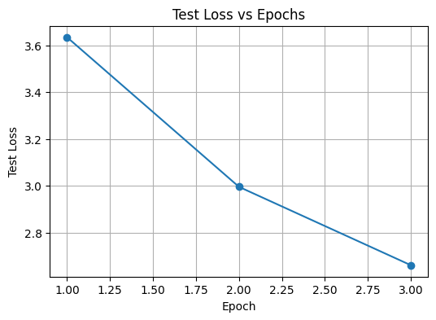

# Sequence-to-Sequence English–French Translation Dataset

## Project Overview
This repository contains a comprehensive English–French parallel translation dataset designed for training and evaluating Sequence-to-Sequence (Seq2Seq) neural machine translation models with attention mechanisms using PyTorch.

---

## Dataset Details

### Source Information
- **Source**: Tatoeba Project (tatoeba.org)
- **Dataset Name**: English-French Translation Corpus
- **Total Sentence Pairs**: 135,843
- **Language Pair**: English ↔ French

### Dataset Format
- **File Format**: Tab-Separated Values (TSV)
- **Encoding**: UTF-8 (supports French accented characters)
- **Structure**: Each line contains exactly 2 columns:
  - **Column 1**: English sentence
  - **Column 2**: French translation

### Sample Data
```
English                              French
Go.                                  Va !
Run!                                 Cours !
Stop!                                Ça suffit !
I see.                               Je comprends.
I won!                               J'ai gagné !
Wait!                                Attends !
Help!                                À l'aide !
Attack!                              Attaque !
```

### Data Characteristics
- **Sentence Length**: 1 word to ~150 words per sentence
- **Domain**: General conversation and everyday language
- **Quality**: High-quality human translations from Tatoeba Project
- **Language Pair Quality**: Well-aligned parallel corpus suitable for machine translation

---

## Data Preprocessing

The raw dataset has been cleaned and processed with the following steps:

1. **Text Normalization**: Removed extra whitespace and standardized spacing
2. **Encoding Validation**: Ensured proper UTF-8 encoding for special characters
3. **Data Validation**: Filtered out empty or incomplete pairs
4. **Format Conversion**: Converted to clean TSV format with column headers

**Preprocessing Script**: `src/preprocess.py`

---

## Train/Test Data Split

### Split Configuration
- **Training Set**: 108,673 pairs (80%)
- **Test Set**: 27,169 pairs (20%)
- **Total Dataset**: 135,842 pairs (after cleaning)
- **Split Method**: `sklearn.model_selection.train_test_split`
- **Random Seed**: 42 (for reproducibility)

### Generated Files
All processed datasets are saved in TSV format with headers:

| File | Pairs | Purpose |
|------|-------|---------|
| `data/eng-fra_cleaned.tsv` | 135,842 | Full cleaned dataset |
| `data/eng-fra_train.tsv` | 108,673 | Model training |
| `data/eng-fra_test.tsv` | 27,169 | Model evaluation |

---

## Choice of Hyperparameters

The Seq2Seq model with Bahdanau attention was trained using the following hyperparameters. These values were selected to balance model performance and training efficiency.

| Hyperparameter | Value |
|---|---|
| Embedding Size | 256 |
| Hidden Size | 256 |
| Batch Size | 64 |
| Epochs | 10 |
| Learning Rate | 0.001 |
| Optimizer | Adam |
| Attention Type | Bahdanau Attention |
| Loss Function | CrossEntropyLoss |

These hyperparameters were chosen to allow the model to learn meaningful representations while keeping training computationally manageable.

## Repository Structure

```
seq2seq/
├── README.md                              # Project documentation
├── seq2seq_bahdanau_with_plots.py         # Seq2Seq model with Bahdanau attention and training pipeline
│
├── src/
│   ├── preprocess.py                      # Data preprocessing script
│   ├── training_loss.png                  # Training loss plot
│   └── test_loss.png                      # Test loss plot
│
├── data/
│   ├── eng-fra.txt                        # Original dataset (raw)
│   ├── eng-fra_cleaned.tsv                # Cleaned dataset
│   ├── eng-fra_train.tsv                  # Training dataset
│   └── eng-fra_test.tsv                   # Test dataset

```

## Usage

### Loading the Dataset

```python
import pandas as pd

# Load training data
train_df = pd.read_csv('data/eng-fra_train.tsv', sep='\t')

# Load test data
test_df = pd.read_csv('data/eng-fra_test.tsv', sep='\t')

# Access data
english_sentences = train_df['English'].tolist()
french_sentences = train_df['French'].tolist()
```

### Running the Preprocessing Script

```bash
python src/preprocess.py
```

This will:
- Load the raw `eng-fra.txt` file
- Clean and normalize the text
- Generate the three TSV files (cleaned, train, test)
- Display statistics and sample examples

---

## Training Loss Plot

The following plot shows how the training loss decreases across epochs as the Seq2Seq model learns to translate English sentences into French.



---

## Test Loss Plot

The following plot shows the loss on the test dataset. This helps evaluate how well the model generalizes to unseen sentences.



---

## Sample Examples from Test Set

### Example 1
- **English**: "Go away!"
- **French**: "Dégage !"

### Example 2
- **English**: "We saw another ship far ahead."
- **French**: "On a vu un autre bateau loin en tête."

### Example 3
- **English**: "How did you become interested in studying languages?"
- **French**: "Comment en êtes-vous venu à vous intéresser à l'étude des langues ?"

### Example 4
- **English**: "I love trying out new things, so I always buy products as soon as they hit the store shelves."
- **French**: "J'adore essayer de nouvelles choses, alors j'achète toujours des produits dès qu'ils sont en rayons."

### Example 5
- **English**: "A child who is a native speaker usually knows many things about his language that a non-native speaker will never know."
- **French**: "Un enfant qui est un locuteur natif connaît habituellement de nombreuses choses sur son langage qu'un locuteur non-natif ne saura jamais."

---

## Requirements

- Python 3.7+
- pandas
- scikit-learn

**Setup**

- python3 -m venv .venv
- source .venv/bin/activate
- pip install --upgrade pip
- pip install pandas scikit-learn
- pip install torch
---

## Citation

**Dataset Source**: Tatoeba Project (https://tatoeba.org/)

---

## Author
Sravani B

## Date
February 28, 2026
